# react-native-e-shop

A simple react native project that consists of:
1) A bottom tabs navigation bar which consists of
   - Home
   - Search
   - Cart
   - Favourites
   - Profile
2) Home tab
   - A `GET` request is triggered with `react-query` to `https://fakestoreapi.com`, which is going to return a list of products.
   - This list is shown in a FlatList in Home tab.
   - The product card contains:
     - Image of product
     - Title
     - Favourite button/indicator
     - `Add to cart` button
     - Price
   - You can interact by pressing a product's card which is going to navigate you to the Products details screen.
   - You can mark as favourite or add the product to your cart from the buttons in the product card.
3) Search tab, is utilizing the same API
   - The search term is not being used in the API call because it is not supported by the selected API
   - The mechanism is ready to use with any API that supports that functionality
   - A mechanism for the last 3 recent searches is available to use
   - After a search an API call will take place through `react-query` which is going to return the list of products
4) Cart tab
   - Here you are going to see a list of products that you have added to cart through the `Add to cart`
   - The card component has a quantity component instead of the `Add to cart` one compared to the home screen cards
   - You can increase the number of each product which is going to change the subtotal of the product and the total cost of your order
   - You can remove an item from your cart by swiping from your right and then tapping the delete button at the right of the product card
   - At the bottom of the screen there is a floating button `Proceed to checkout` which contains the total price of your cart
     - By clicking it you will be navigated to an empty/dummy checkout screen
   - The cart tab button/icon will indicate at the top right the number of products (sum of quantities) in total
5) Favourites tab
   - Contains the list of favourite products
   - You can remove each one by tapping the favourite button in each product card
6) Profile tab
   - Empty/dummy profile screen
7) Product screen, consists of:
   - Image of the product
   - Title and Favourite button section
   - Rating and Votes section
   - Price and `Add to cart` button section
   - Description section which is showing 4 lines of text and has a button to interact with the drawer

## Notes

- `Fakestoreapi` doesn't have pagination, thus no infinite scroll was implemented on the search list.
- Tested on iOS devices.

## Environment
```shell
"npm": "8.11.0", # Globally installed
"node": "^16", # Globally installed
"yarn": "1.22.19", # Globally installed
"react": "18.2.0",
"react-native": "0.72.3",
```

## Install dependencies

```shell
nvm use 16
npm install --global yarn # Or use npx before each yarn command

# Install dependencies, start metro bundler and build app
yarn clean-start
yarn ios # Will run application to latest iPhone simulator
```

## App functionality

### Home screen
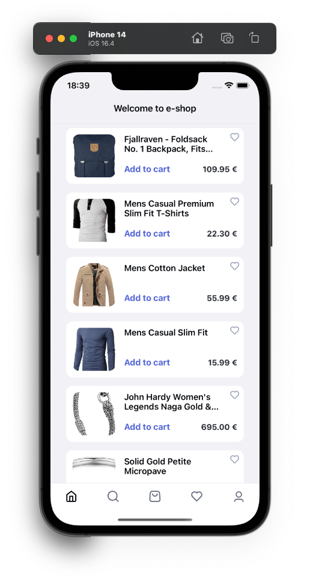
### Search screen - Empty state - No searches
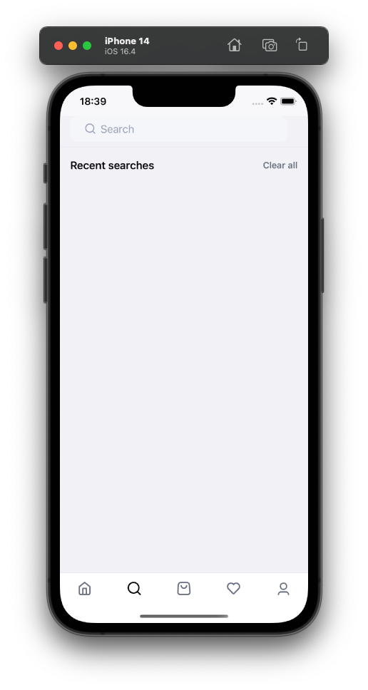
### Search screen - Search results
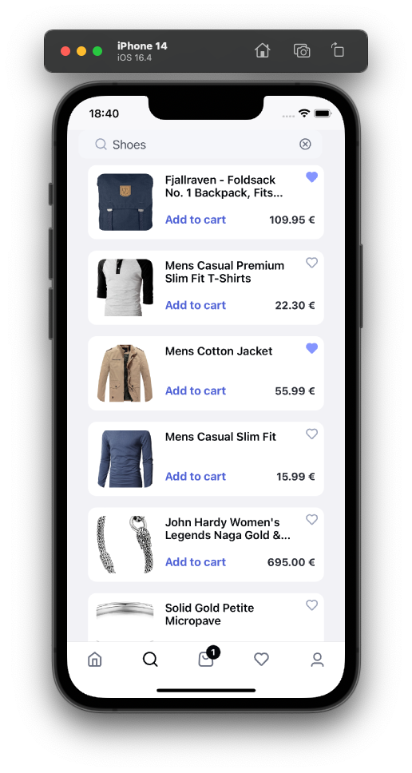
### Search screen - Empty state - Recent search
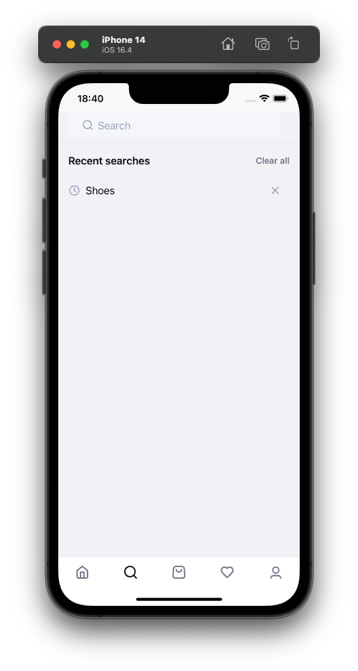
### Cart screen - Empty state
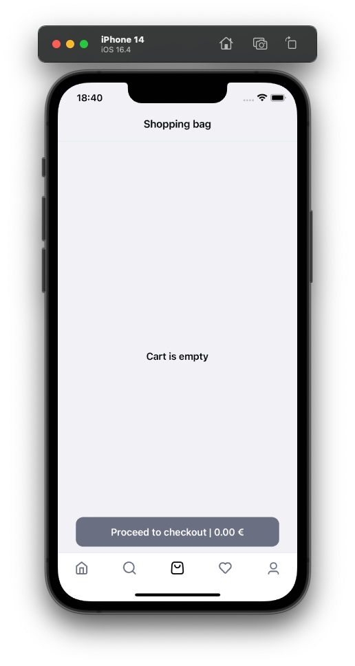
### Cart screen - Products in cart
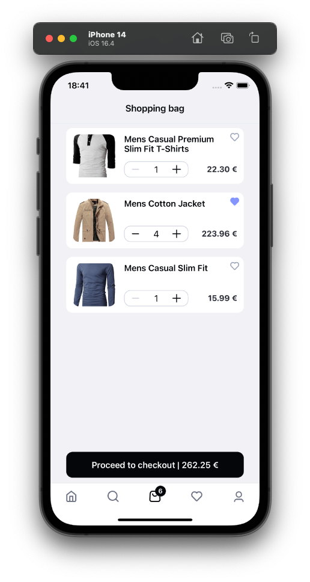
### Cart screen - Delete product from cart
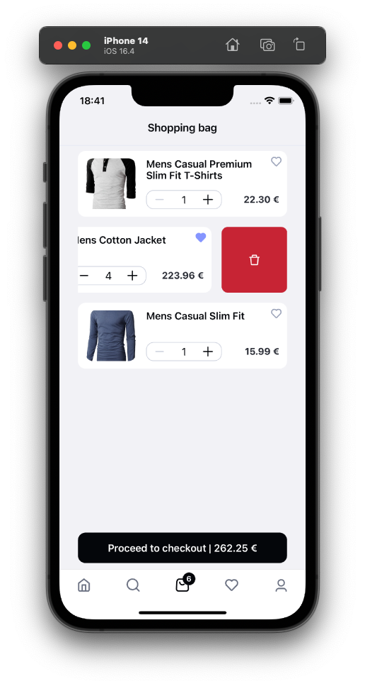
### Checkout screen
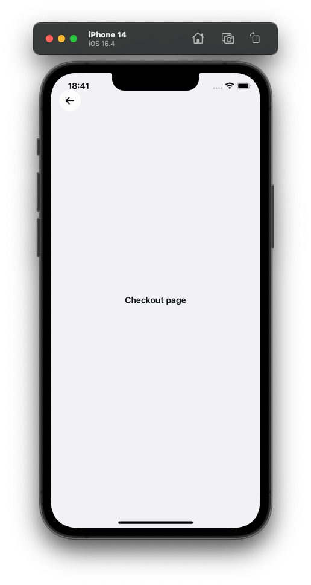
### Favourites screen - Products in list
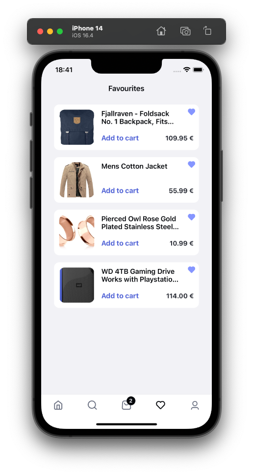
### Product screen - Drawer closed
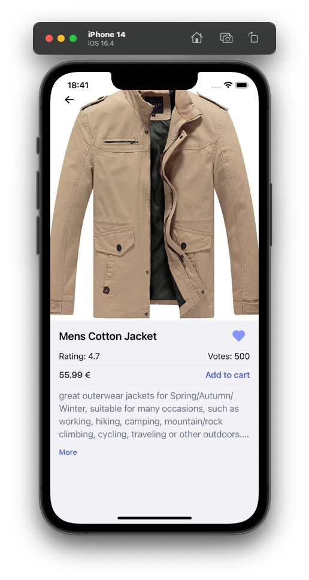
### Product screen - Drawer opened
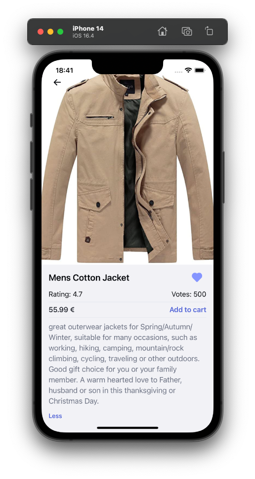
### Profile screen
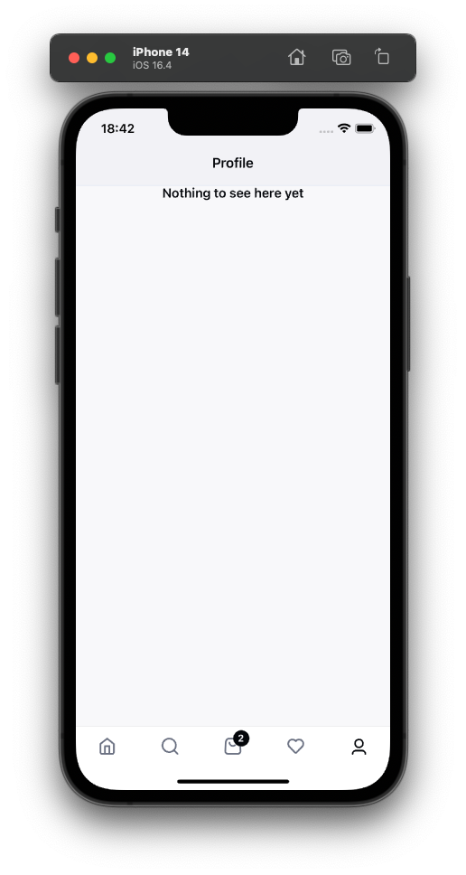
